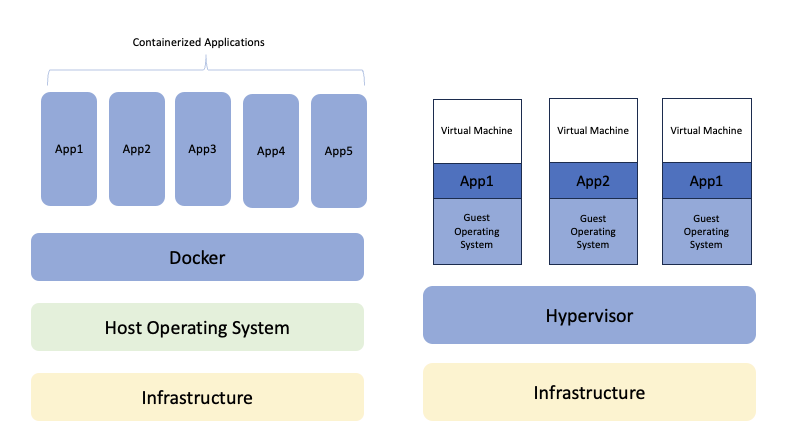

# **Docker Terminology**

# What is docker

Docker is a technology that allows you to package and run applications and their dependencies inside isolated containers. These containers are lightweight and portable.

# What is a Docker image?
	
a Docker image is like a snapshot or a template that contains everything needed to run a piece of software, including the code, runtime, libraries, and system tools. 

# What is a container?

A Docker container is a runnable instance created from a Docker image. 

# Why Docker Comes into Picture

Before the Docker all of us is facing many issues like when we build the application and after test all scenarios, we passed that to the QA environment and then on the machine of QA members we need to take care of all the dependencies and version of assemblies and framework. So due to there is gap between QA and Development team and also waste the time. So, when we use Docker, this problem will get sorted and we use Docker Image on any platform without too much configuration.

# Docker Containers vs Virtual Machines
 

* Docker containers can be easily integrated compared to VMs.

* With a fully virtualized system, you get more isolation.

* However, it requires more resources. With Docker, you get less isolation. However, as it requires fewer resources, you can run thousands of container on a host.

* A VM can take a minimum of one minute to start, while a Docker container usually starts in a fraction of seconds.

* Containers are easier to break out of than a Virtual Machine.

* Unlike VMs there is no need to preallocate the RAM. Hence docker containers utilize less RAM compared to VMs. So only the amount of RAM that is required is used.

# **Technology Used in Docker**

The programming language used in Docker is GO. Docker takes advantage of various features of Linux kernel like namespaces and cgroups.

**namespaces:** Docker uses namespaces to provide isolated workspace called containers. When a container is run, docker creates a set of namespaces for it, providing a layer of isolation. Each aspect of a container runs in a separate namespace and its access is limited to that namespace.

**cgroups( control groups )**: croups are used to limit and isolate the resource usage( CPU, memory, Disk I/O, network etc ) of a collection of processes. cgroups allow Docker engine to share the available hardware resources to containers and optionally enforce limit and constraints.

**UnionFS( Union file systems )**: are file systems that operate by creating layers, making them very lightweight and fast.It is used by Docker engine to provide the building blocks for containers.

Docker Engine combines the namespaces, cgroups, and UnionFS into a wrapper called a container format. The default container format is libcontainer.

# **Install Docker Desktop**
The best way to get started developing containerized applications is with Docker Desktop, for OSX or Windows. Docker Desktop will allow you to easily set up Kubernetes or Swarm on your local development machine, so you can use all the features of the orchestrator you’re developing applications for right away, no cluster required. Follow the installation instructions appropriate for your operating system:

OSX
Windows
Docker Daily use commands
1. docker –version
This command is used to get the currently installed version of docker
2. docker pull
Usage: docker pull <image name>
This command is used to pull images from the docker repository(hub.docker.com)
3. docker run
Usage: docker run -it -d <image name>
This command is used to create a container from an image
4. docker ps
This command is used to list the running containers
5. docker ps -a
This command is used to show all the running and exited containers
6. docker exec
Usage: docker exec -it <container id> bash
This command is used to access the running container
7. docker stop
Usage: docker stop <container id>
This command stops a running container
8. docker kill
Usage: docker kill <container id>
This command kills the container by stopping its execution immediately. The difference between ‘docker kill’ and ‘docker stop’ is that ‘docker stop’ gives the container time to shutdown gracefully, in situations when it is taking too much time for getting the container to stop, one can opt to kill it
9. docker commit
Usage: docker commit <conatainer id> <username/imagename>
This command creates a new image of an edited container on the local system
10. docker login
This command is used to login to the docker hub repository
11. docker push
Usage: docker push <username/image name>
This command is used to push an image to the docker hub repository
12. docker images
This command lists all the locally stored docker images
13. docker rm
Usage: docker rm <container id>
This command is used to delete a stopped container
14. docker rmi
Usage: docker rmi <image-id>
This command is used to delete an image from local storage
15. docker build
Usage: docker build <path to docker file>
This command is used to build an image from a specified docker file

# **Creating Our First Docker Application**

Let say we have a PHP application and want to deploy it to our staging or production server. First, we make sure we have docker configuration script included in the root directory of the application.

1. Create a Dockerfile in your application

Create a file with name Dockerfile at the root of your application and include the code below to tell docker what to do when running in the production or staging environment

FROM PHP:7.2-Apache
COPY src/ /var/www/html/
EXPOSE 80
Above is a sample docker script which configures PHP version 7.2 on a staging or production server, copy the PHP files from /src directory to /var/www/html/ and expose the port 80 to be reached on.

2. Installing Docker on Staging Or Production Server
For Mac get docker here.
For Windows go here.

3. Running Docker
After docker is installed on the staging or production server, click on the whale icon to run docker

4. Deploying Your Application
   
Copy the application to the staging or production server and do the following

Navigate to the project directory on the terminal and create a docker image.

Run the following command in the terminal and it will create a docker image of the application and download all the necessary dependencies needed for the application to run successfully

docker build -t <name to give to your image>

Convert Docker image of the Application into a Running container.

Run the following command in terminal and it will use create a running container with all the needed dependencies and start the application.

$ docker run -p 9090:80 name to give to your container

The 9090 is the port we want to access our application on.

80 is the port the container is exposing for the host to access.

Below are some useful Docker commands

Stopping a running image

$ docker stop id-of-image

Starting an image which is not running

$docker start id-of-image

Removing an image from docker

$ docker rmi id-of-image

Removing a container from docker

$ docker rm id-of-container